<!-- TOC -->

- [01、acceptor线程（默认1个）](#01acceptor线程默认1个)
- [02、ClientPoller线程（默认2个）](#02clientpoller线程默认2个)
- [03、exe线程（默认10个）](#03exe线程默认10个)
    - [1、压测](#1压测)
        - [1、线程池150，并发300，默认队列，处理1秒](#1线程池150并发300默认队列处理1秒)
        - [2、线程池150，并发450，默认队列，处理1秒](#2线程池150并发450默认队列处理1秒)
        - [3、线程池150，并发300，队列大小150](#3线程池150并发300队列大小150)
        - [4、线程池150，并发150，队列150，处理2秒](#4线程池150并发150队列150处理2秒)
        - [5、线程池150，并发300，队列150，处理2秒](#5线程池150并发300队列150处理2秒)
        - [6、线程池500，并发1000，队列100，处理2秒](#6线程池500并发1000队列100处理2秒)
- [04、NioBlockingSelector.BlockPoller（默认2个）](#04nioblockingselectorblockpoller默认2个)
- [05、AsyncTimeout](#05asynctimeout)
- [06、ContainerBackgroundProcessor线程](#06containerbackgroundprocessor线程)
- [07、main线程](#07main线程)
- [08、AsyncFileHandlerWriter线程](#08asyncfilehandlerwriter线程)
- [99、Tomcat优化](#99tomcat优化)
- [参考](#参考)

<!-- /TOC -->

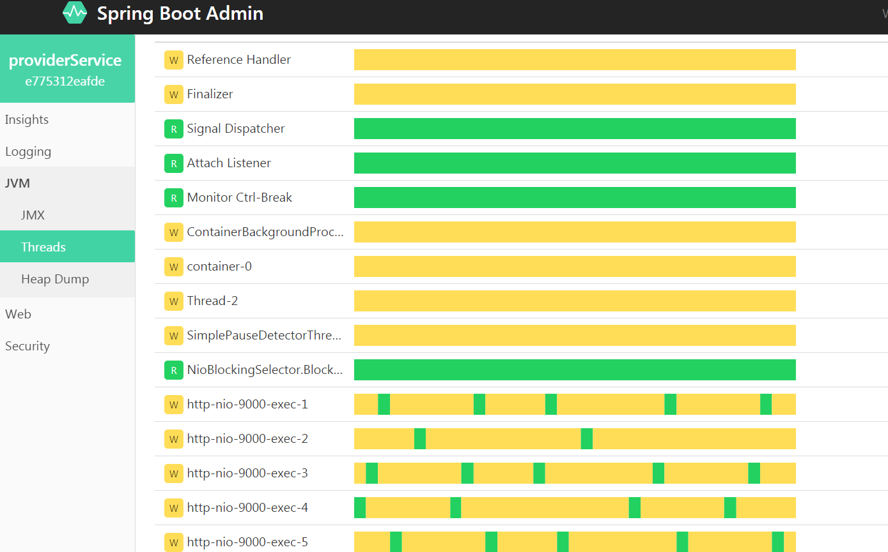

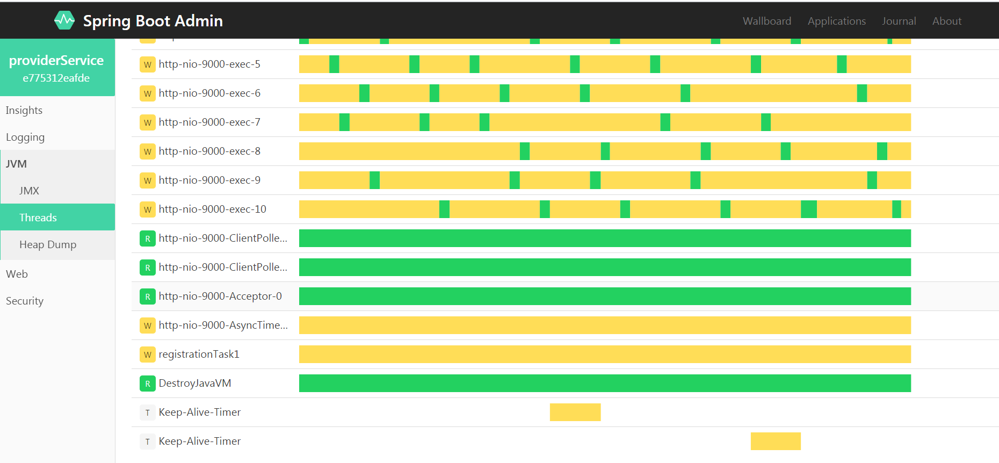

备注：springboot内嵌Tomact线程


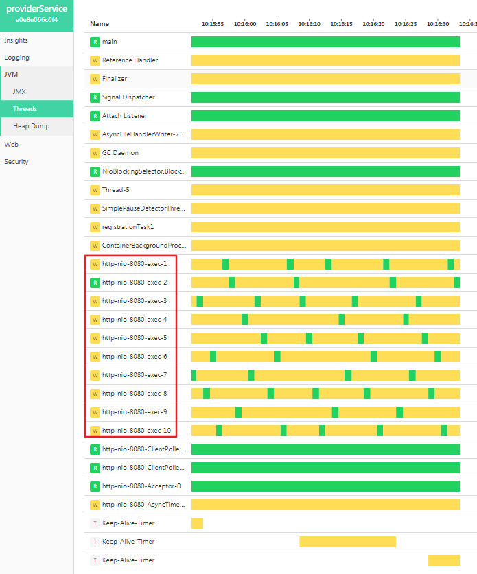

备注：springboot-war包放在外置的Tomcat启动线程


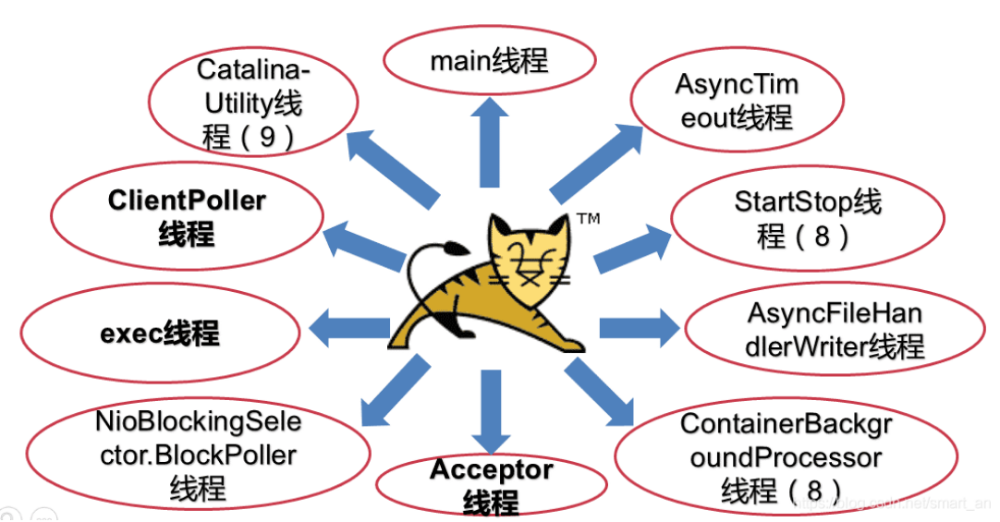


> acceptor线程\Poller线程\exe线程之间的关系

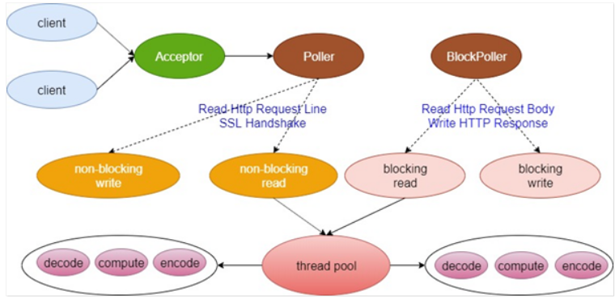


# 01、acceptor线程（默认1个）

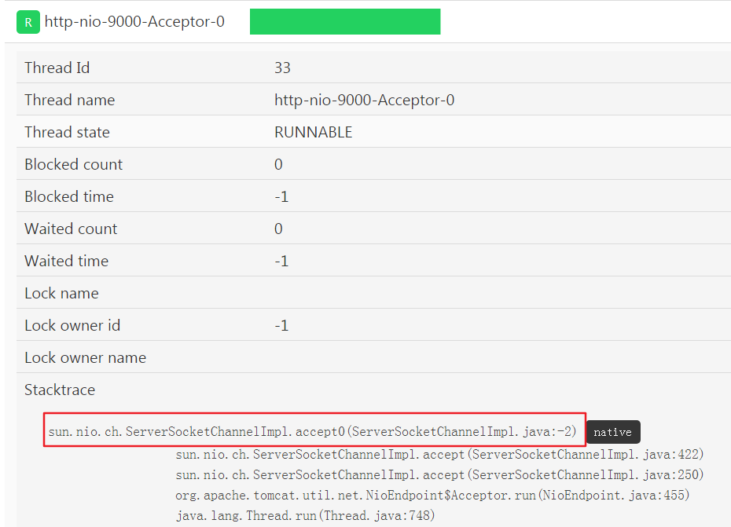

Connector(实际是在AbstractProtocol类中)初始化和启动之时，启动了Endpoint，Endpoint就会启动poller线程和Acceptor线程。Acceptor底层就是ServerSocket.accept()。返回Socket之后丢给NioChannel处理,之后通道和poller线程绑定。

`acceptor->poller->exec`

无论是NIO还是BIO通道，都会有Acceptor线程，该线程就是进行socket接收的，它不会继续处理，如果是NIO的，无论是新接收的包还是继续发送的包，直接就会交给Poller，而BIO模式，Acceptor线程直接把活就给工作线程了。

如果不配置，Acceptor线程默认开始就开启1个，后期再随着压力增大而增长

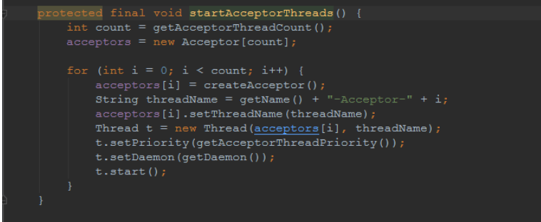

# 02、ClientPoller线程（默认2个）

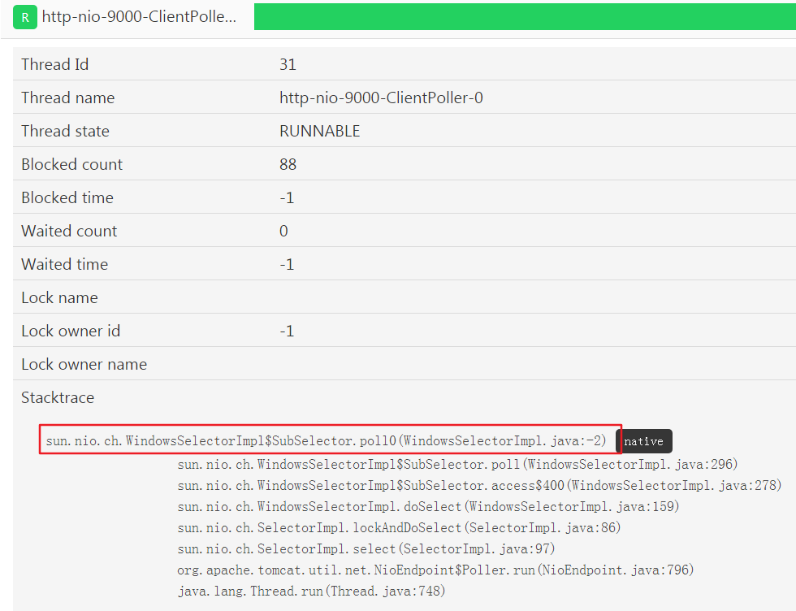

NIO和APR模式下的Tomcat前端，都会有Poller线程。

对于Poller线程实际就是继续接着Acceptor进行处理，展开Selector，然后遍历key，将后续的任务转交给工作线程（exec线程），起到的是一个缓冲，转接，和NIO事件遍历的作用，具体代码体现如下（NioEndpoint类）

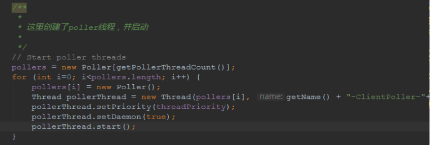


备注：http-nio-9000-ClientPoller-0和http-nio-9000-ClientPoller-1

# 03、exe线程（默认10个）

在tomcat中每一个用户请求都是一个线程，所以可以使用线程池提高性能。 修改server.xml文件：

```
<!‐‐将注释打开（注释没打开的情况下默认10个线程，最小10，最大200）‐‐>
<Executor name="tomcatThreadPool" namePrefix="catalina‐exec‐"
maxThreads="500" minSpareThreads="50"
prestartminSpareThreads="true" maxQueueSize="100"/>
<!‐‐
参数说明：
maxThreads：最大并发数，默认设置 200，一般建议在 500 ~ 1000，根据硬件设施和业
务来判断
minSpareThreads：Tomcat 初始化时创建的线程数，默认设置 25
prestartminSpareThreads： 在 Tomcat 初始化的时候就初始化 minSpareThreads 的
参数值，如果不等于 true，minSpareThreads 的值就没啥效果了
maxQueueSize，最大的等待队列数，超过则拒绝请求
‐‐>
<!‐‐在Connector中设置executor属性指向上面的执行器‐‐>
<Connector executor="tomcatThreadPool" port="8080" protocol="HTTP/1.1"
connectionTimeout="20000"
redirectPort="8443" />
```


也就是SocketProcessor线程，上述几个线程都是定义在NioEndpoint内部线程类。NIO模式下，Poller线程将解析好的socket交给SocketProcessor处理，它主要是http协议分析，攒出Response和Request，然后调用Tomcat后端的容器：

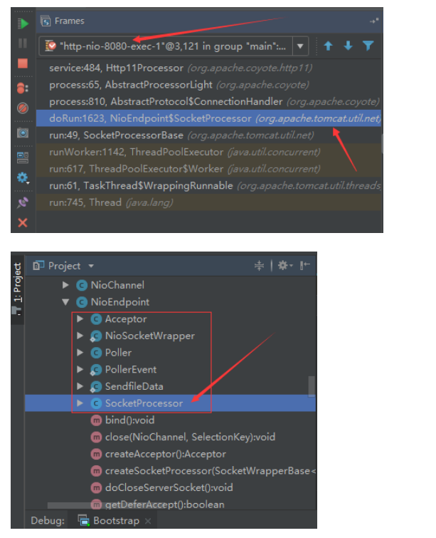

该线程的重要性不言而喻，Tomcat主要的时间都耗在这个线程上，所以我们可以看到Tomcat里面有很多的优化，配置，都是基于这个线程的，尽可能让这个线程减少阻塞，减少线程切换，甚至少创建，多利用。


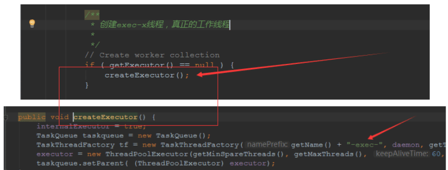

实际上也是JDK的线程池，只不过基于Tomcat的不同环境参数，对JDK线程池进行了定制化而已，本质上还是JDK的线程池。


备注：外置的Tomcat默认最小10、最大是200，如果并发数大于10会自动创建，之后会慢慢回收到10。而springboot内置的默认最小也是10，最大的达到520多个；


线程池的个数可以在server.xml中进行配置。

我这里打开了配置文件中注释掉的默认线程池：

```xml
<Executor name="tomcatThreadPool" namePrefix="catalina-exec-"
    maxThreads="150" minSpareThreads="4"/>

<Connector executor="tomcatThreadPool"
            port="8080" protocol="HTTP/1.1"
            connectionTimeout="20000"
            redirectPort="8443" />
```

这里设置的线程个数默认最小时4，最大是150，而且线程的前缀为catalina-exec-

下面是在springboot中监控，看到的竟然创建了5个，为什么？？？

需要打开参数prestartminSpareThreads="true"否则不生效，也就是说上面那样配置默认开启5个线程？

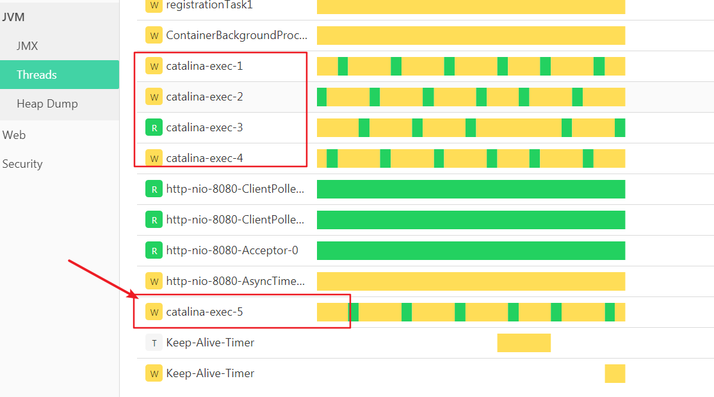


下面是使用1000个并发，最大线程个数创建到150个不再增加。


在tomcat8及后续的版本中有最新的nio2，速度更快，建议使用nio2。通过protocol="org.apache.coyote.http11.Http11Nio2Protocol"来设置。

NIO2异步的本质是数据从内核态到用户态这个过程是异步的，也就是说nio中这个过程必须完成了才执行下个请求，而nio2不必等这个过程完成就可以执行下个请求，nio2的模式中数据从内核态到用户态这个过程是可以分割的。

```xml
<Connector executor="tomcatThreadPool" port="8080"
protocol="org.apache.coyote.http11.Http11Nio2Protocol"
connectionTimeout="20000"
redirectPort="8443" />
```


## 1、压测

测试代码逻辑，sleep一秒钟模拟业务逻辑处理

```java
@RestController
public class RestfulController {
    @GetMapping("/restful/name")
    public Object test() {
        Map<String,String> map = new HashMap<>();
        try {
            Thread.sleep(1000l);
        } catch (InterruptedException e) {
            e.printStackTrace();
        }
        map.put("name","lishuai");
        return map;
    }
}
```

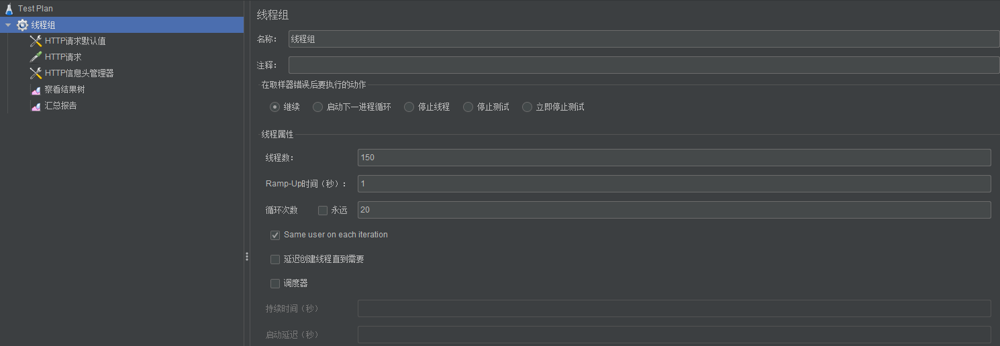


备注初始线程池最大150，并发数也是150，间隔一秒循环20次。从结果看平均响应时间在100左右。


有个疑问，在springboot admin http trace页面的瞬间并发最大好像就是100了？？？


### 1、线程池150，并发300，默认队列，处理1秒


可见并发数扩大一倍，平均响应时间也基本扩大一倍。


### 2、线程池150，并发450，默认队列，处理1秒


可见并发数扩大两倍，平均响应时间也基本扩大两倍。


### 3、线程池150，并发300，队列大小150


Tomcat后台日志报错

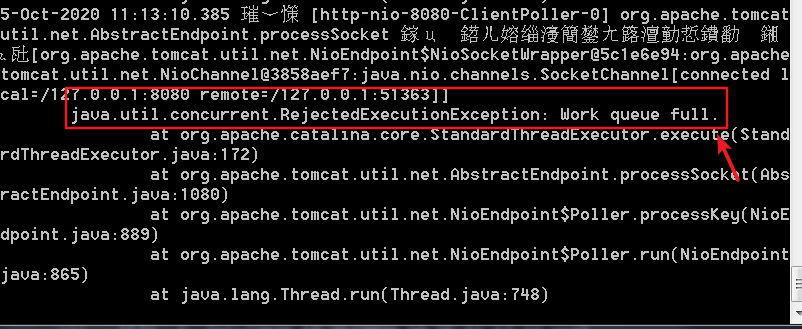

备注：这里的最小值为0应该是因为拒绝造成的。

把线程池初始直接初始化为150个情况


从结果来看只是拒绝了十几个？？？


### 4、线程池150，并发150，队列150，处理2秒


理论上不拒绝，实际也是。


### 5、线程池150，并发300，队列150，处理2秒


理论是应该拒绝450个，实际拒绝了400多一点。

### 6、线程池500，并发1000，队列100，处理2秒


# 04、NioBlockingSelector.BlockPoller（默认2个）

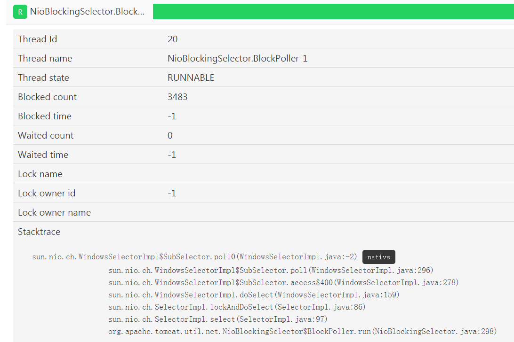

备注：为什么在springboot的页面只有一个？？？

Nio方式的Servlet阻塞输入输出检测线程。实际就是在Endpoint初始化的时候启动selectorPool，selectorPool再启动selector，selector内部启动BlokerPoller线程。

NIO通道的Servlet输入和输出最终都是通过NioBlockingPool来完成的，而NioBlockingPool又根据Tomcat的场景可以分成阻塞或者是非阻塞的，对于阻塞来讲，为了等待网络发出，需要启动一个线程实时监测网络socketChannel是否可以发出包，而如果不这么做的话，就需要使用一个while空转，这样会让工作线程一直损耗。

只要是阻塞模式，并且在Tomcat启动的时候，添加了—D参数 org.apache.tomcat.util.net.NioSelectorShared 的话，那么就会启动这个线程。

大体上启动顺序如下：

```java
//bind方法在初始化就完成了
Endpoint.bind(){
    //selector池子启动
    selectorPool.open(){
        //池子里面selector再启动
         blockingSelector.open(getSharedSelector()){
             //重点这句
              poller = new BlockPoller();
              poller.selector = sharedSelector;
              poller.setDaemon(true);
              poller.setName("NioBlockingSelector.BlockPoller-"+       (threadCounter.getAndIncrement()));
             //这里启动
              poller.start();
         }
    }
}
```


# 05、AsyncTimeout

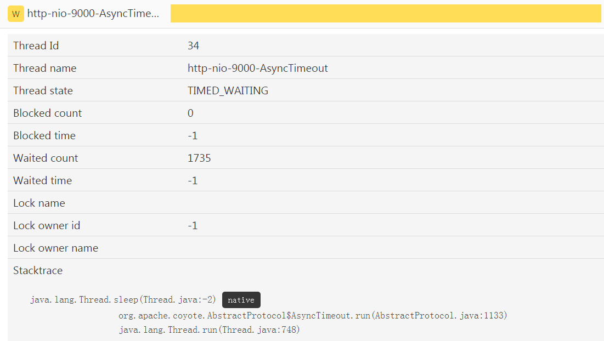

该线程为tomcat7及之后的版本才出现的，注释其实很清楚，该线程就是检测异步request请求时，触发超时，并将该请求再转发到工作线程池处理（也就是Endpoint处理）。

AsyncTimeout线程也是定义在AbstractProtocol内部的，在start()中启动。AbstractProtocol是个极其重要的类，他持有Endpoint和ConnectionHandler这两个tomcat前端非常重要的类


# 06、ContainerBackgroundProcessor线程

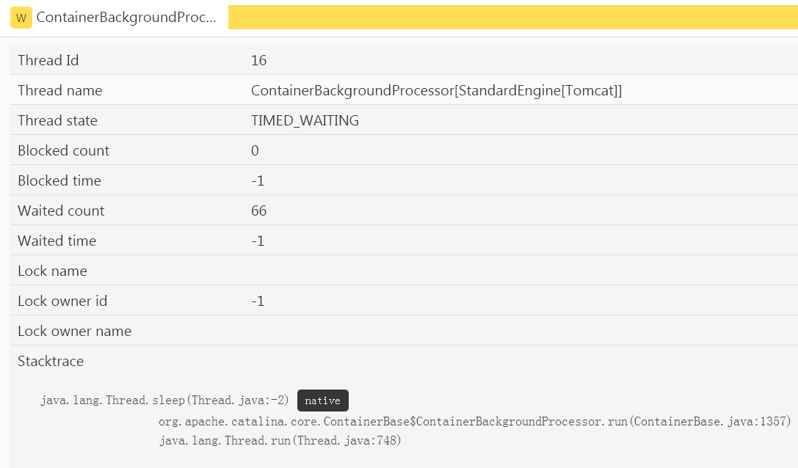

Tomcat在启动之后，不能说是死水一潭，很多时候可能会对Tomcat后端的容器组件做一些变化，例如部署一个应用，相当于你就需要在对应的Standardhost加上一个StandardContext，也有可能在热部署开关开启的时候，对资源进行增删等操作，这样应用可能会重新reload。

也有可能在生产模式下，对class进行重新替换等等，这个时候就需要在Tomcat级别中有一个线程能实时扫描Tomcat容器的变化，这个就是ContainerbackgroundProcessor线程了

我们可以看到这个代码，也就是在ContainerBase中：


这个线程是一个递归调用，也就是说，每一个容器组件其实都有一个backgroundProcessor，而整个Tomcat就点起一个线程开启扫描，扫完儿子，再扫孙子（实际上来说，主要还是用于StandardContext这一级，可以看到StandardContext这一级：


我们可以看到，每一次backgroundProcessor，都会对该应用进行一次全方位的扫描，这个时候，当你开启了热部署的开关，一旦class和资源发生变化，立刻就会reload。


# 07、main线程

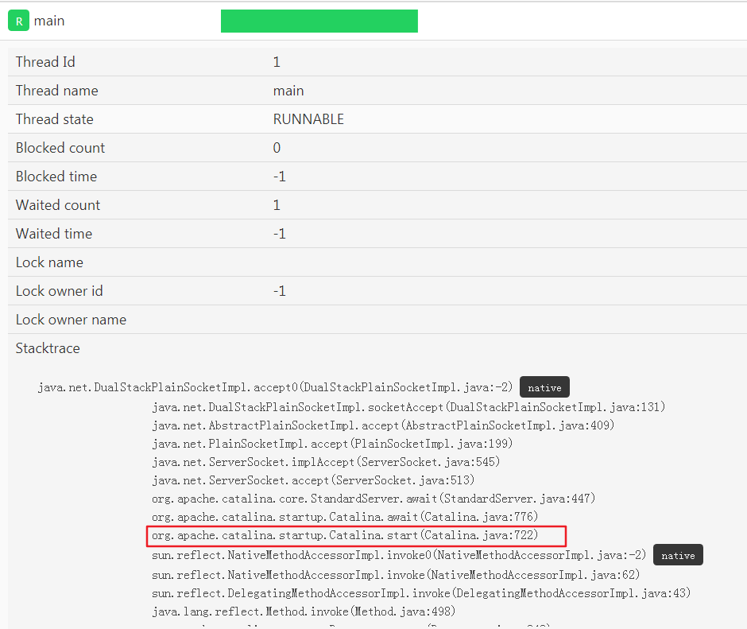

main线程是tomcat的主要线程，其主要作用是通过启动包来对容器进行点火：

main线程一路启动了Catalina，StandardServer[8005]，StandardService[Catalina]，StandardEngine[Catalina]

​ engine内部组件都是异步启动，engine这层才开始继承ContainerBase，engine会调用父类的startInternal()方法，里面由startStopExecutor线程提交FutureTask任务，异步启动子组件StandardHost，

​ StandardEngine[Catalina].StandardHost[localhost]

main->Catalina->StandardServer->StandardService->StandardEngine->StandardHost，黑体开始都是异步启动。

​ ->启动Connector

main的作用就是把容器组件拉起来，然后阻塞在8005端口，等待关闭。


# 08、AsyncFileHandlerWriter线程

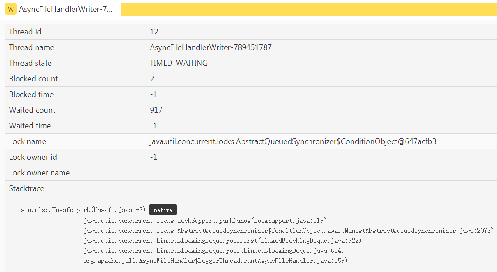

顾名思义，该线程是用于异步文件处理的，它的作用是在Tomcat级别构架出一个输出框架，然后不同的日志系统都可以对接这个框架，因为日志对于服务器来说，是非常重要的功能。


该线程主要的作用是通过一个LinkedBlockingDeque来与log系统对接，该线程启动的时候就有了，全生命周期。


# 99、Tomcat优化

tomcat的优化，主要是从2个方面入手，一是，tomcat自身的配置，另一个是tomcat所运行的jvm虚拟机的调优。


# 参考

- [tomcat堆栈中10大常见线程详解](https://blog.csdn.net/smart_an/article/details/106592347)

- [tomcat性能优化](https://smartan123.github.io/book/?file=001-%E6%80%A7%E8%83%BD%E4%BC%98%E5%8C%96/002-%E6%80%A7%E8%83%BD%E4%BC%98%E5%8C%96%E8%A7%A3%E5%86%B3%E6%96%B9%E6%A1%88/0021-tomcat%E6%80%A7%E8%83%BD%E4%BC%98%E5%8C%96)

- [详解tomcat的连接数与线程池](https://www.cnblogs.com/kismetv/p/7806063.html)