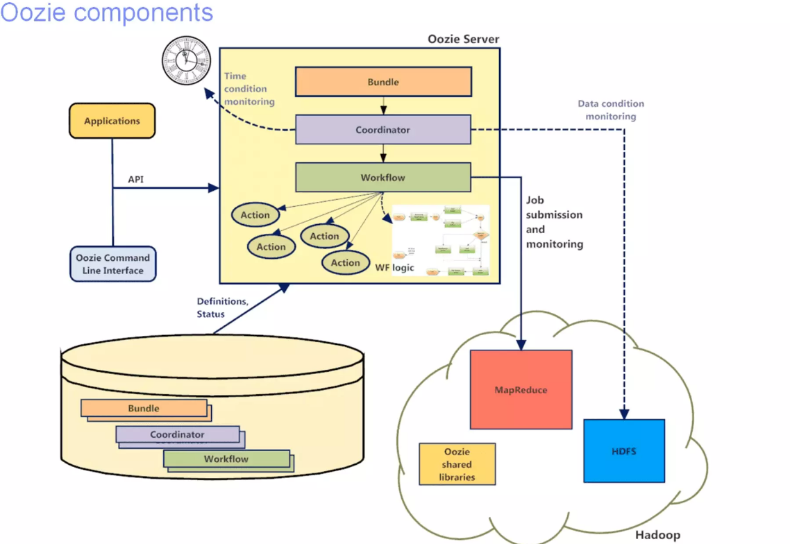
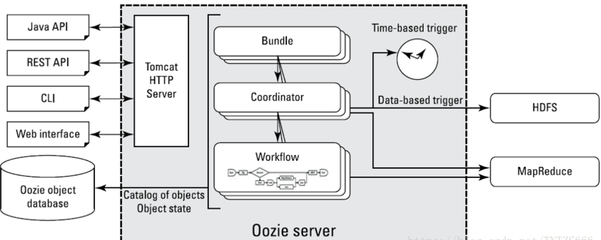

<!-- TOC -->autoauto- [1、概念](#1概念)auto- [2、工作原理](#2工作原理)auto- [参考](#参考)autoauto<!-- /TOC -->

> 问题

（1）目前计算框架和作业类型繁多：MapReduce Java、Streaming、HQL、Pig等。

（2）如何对这些框架和作业进行统一管理和调度：

- 1、不同作业之间存在依赖关系（DAG：有向无环图，指定了作业之间的调度关系）；
- 2、周期性作业；
- 3、定时执行的作业；
- 4、作业执行状态监控与报警；

（3）多种解决方案
- 1、crontab（crontab文件包含送交cron守护进程的一系列作业和指令。每个用户可以拥有自己的crontab文件；同时，操作系统保存一个针对整个系统的crontab文件，该文件通常存放于/etc或者/etc之下的子目录中，而这个文件只能由系统管理员来修改）；
- 2、自己设计调度系统；
- 3、直接使用开源系统。

`Oozie工作流任务调度器`

oozie本质就是一个作业协调工具（底层原理是通过将xml语言转换成mapreduce程序来做，但只是在集中map端做处理，避免shuffle的过程。）

Oozie的工作流必须是一个有向无环图，实际上Oozie就相当于Hadoop的一个客户端，当用户需要执行多个关联的MR任务时，只需要将MR执行顺序写入workflow.xml，然后使用Oozie提交本次任务，Oozie会托管此任务流。

# 1、概念

Oozie is a workflow scheduler system to manage Apache Hadoop jobs.

Oozie Workflow jobs are Directed Acyclical Graphs (DAGs) of actions.

Oozie Coordinator jobs are recurrent Oozie Workflow jobs triggered by time (frequency) and data availability.

Oozie is integrated with the rest of the Hadoop stack supporting several types of Hadoop jobs out of the box (such as Java map-reduce, Streaming map-reduce, Pig, Hive, Sqoop and Distcp) as well as system specific jobs (such as Java programs and shell scripts).

Oozie is a scalable, reliable and extensible system.

- Oozie是管理hadoop作业的工作流调度系统
- Oozie的工作流作业是一系列动作的有向无环图（DAG）
- Oozie协调作业是通过时间（频率）和有效数据触发当前的Oozie工作流程
- Oozie支持各种hadoop作业，例如:java map-reduce、Streaming map-reduce、pig、- hive、sqoop和distcp等等，也支持系统特定的作业，例如java程序和shell脚本。
- Oozie是一个可伸缩，可靠和可拓展的系统

一个基于工作流引擎的开源框架，由Cloudera公司贡献给Apache，提供对Hadoop MapReduce、Pig Jobs的任务调度与协调。Oozie需要部署到Java Servlet容器中运行。主要用于定时调度任务，多任务可以按照执行的逻辑顺序调度。

# 2、工作原理

> Oozie的功能模块介绍

>> 1、模块

- 1) Workflow：顺序执行流程节点，支持fork（分支多个节点），join（合并多个节点为一个）
- 2) Coordinator：定时触发workflow
- 3) Bundle Job：绑定多个Coordinator

>> 2、常用节点

- 1) 控制流节点（Control Flow Nodes）：控制流节点一般都是定义在工作流开始或者结束的位置，比如start,end,kill等。以及提供工作流的执行路径机制，如decision，fork，join等。

- 2) 动作节点（Action  Nodes）：负责执行具体动作的节点，比如：拷贝文件，执行某个Shell脚本等等。

# 参考

- [oozie官网](https://oozie.apache.org/)

- [什么是Oozie——大数据任务调度框架](https://blog.csdn.net/TNTZS666/article/details/81915820)

- [Oozie基础入门](https://blog.csdn.net/weixin_39198774/article/details/79412726)

- [Oozie 简介](https://www.infoq.cn/article/introductionOozie)

