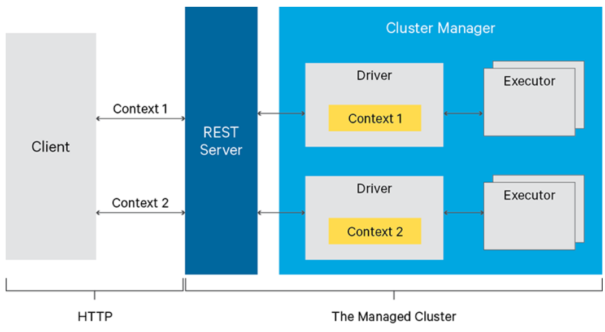

<!-- TOC -->

- [1、概念](#1概念)
- [2、原理](#2原理)
- [3、restful测试](#3restful测试)
    - [1、创建session](#1创建session)
    - [2、获取全部session](#2获取全部session)
    - [3、提交任务code](#3提交任务code)
    - [4、获取执行结果](#4获取执行结果)
    - [5、杀掉session](#5杀掉session)
- [参考](#参考)

<!-- /TOC -->


# 1、概念

livy工作原理：
- 1、先创建一个session或者获取一个空闲的session（有接口可以获取当前全部创建的session，控制状态的可以进行使用，类使用数据库连接池）；
- 2、通过sessionid提交任务，获得一个statementid用来查询提交任务的结果；
- 3、轮询获取下载任务的进行知道任务完成progress（提交时为0，完成时为1）
- 4、我这里通过线程池提交callabler任务，在call方法中循环判断执行进度，最后通过future.get获取执行结果（会阻塞提交任务的线程）

备注：在创建session的时候可指定创建的session类型（kind=spark，sparkr,pyspark，sql），也可不指定，但是需要在提交执行代码的时候指定是哪一种。


从0.5.0-incubating版本开始，每一种session都支持上面四种的Scala, Python和R解释器以及新增的SQL解释器。在创建session的时候可以不再指定kind类型，创建的session类型标识[shared]，但是需要在提交statement 代码的时候指定code的kind类型（spark, pyspark, sparkr or sql）。为了兼容以前的版本，用户还是可以在创建session的时候指定kind，当statement submission忽略kind类型。livy将会用这个session的kind作为默认的kind。用户在提交code任务的时候如果不想用创建时候的kind类型，指定需要的类型即可。


`提交SQL的时候可以直接指定kind=sql,code={具体的SQL片段即可}`

`session分为`


# 2、原理



这里的session分为两种：`spark interactive session和spark batch session`（在这2个里面的底层都是有一个SparkContext的）。interactive session可以直接提交执行的代码，而batch session需要提交存储在hdfs上的jar包。


livy server就是一个rest的服务，收到客户端的请求之后，与spark集群进行连接；客户端只需要把请求发到server上就可以了这样的话，就分为了3层：

- 1、最左边：其实就是一个客户单，只需要向livy server发送请求

- 2、到livy server之后就会去spark集群创建我们的session

- 3、session创建好之后，客户端就可以把作业以代码片段的方式提交上来就OK了，其实就是以请求的方式发到server上就行


架构概况：

- 1、客户端发一个请求到livy server
- 2、Livy Server发一个请求到Spark集群，去创建session
- 3、session创建完之后，会返回一个请求到Livy Server，这样Livy Server就知道session创建过程中的一个状态
- 4、客户端的操作，如：如果客户端再发一个请求过来看一下，比如说看session信息啥的(可以通过GET API搞定)

多用户的特性：上述是一个用户的操作，如果第二个、第三个用户来，可以这样操作：

- 提交过去的时候，可以共享一个session;

- 其实一个session就是一个`SparkContext`;


# 3、restful测试

post请求添加headers = {'Content-Type': 'application/json'}

## 1、创建session

post

http://test.livy.ls.com/sessions

{"kind": "spark"}


返回值：

```json
{
    "id": 7,//sessionid
    "appId": null,
    "owner": null,
    "proxyUser": null,
    "state": "starting",
    "kind": "spark",
    "appInfo": {
        "driverLogUrl": null,
        "sparkUiUrl": null
    },
    "log": [
        "stdout: ",
        "\nstderr: "
    ]
}
```


## 2、获取全部session

get

http://test.livy.ls.com/sessions


返回值：

```json
{
    "from": 0,
    "total": 1,
    "sessions": [
        {
            "id": 7,
            "appId": null,
            "owner": null,
            "proxyUser": null,
            "state": "starting",//session的状态
            "kind": "spark",//类型
            "appInfo": {
                "driverLogUrl": null,
                "sparkUiUrl": null
            },
            "log": [
                "stdout: ",
                "\nstderr: ",
                ...
            ]
        }
    ]
}
```


## 3、提交任务code

post

http://test.livy.ls.com/sessions/7/statements

备注：中间的7即为创建指定的session


代码片段：

{"code":"sc.makeRDD(List(1,2,3,4)).count"}   //统计集合的大小


返回值：

```json
{
    "id": 0,//statementid
    "code": "sc.makeRDD(List(1,2,3,4)).count",
    "state": "waiting",
    "output": null,
    "progress": 0.0  //初始化状态为0
}
```


## 4、获取执行结果

get

http://test.livy.ls.com/sessions/6/statements/0

备注：后面的0为上一步提交后返回的statementid


返回

```json

{
    "id": 0,
    "code": "sc.makeRDD(List(1,2,3,4)).count",
    "state": "available",
    "output": {
        "status": "ok",
        "execution_count": 0,
        "data": {
            "text/plain": "res0: Long = 4\n"
        }
    },
    "progress": 1.0 //执行完成后进度为1
}
```


## 5、杀掉session

delete

http://test.livy.ls.com/sessions/7


返回值：

{
    "msg": "deleted"
}


# 参考

- [livy官网](https://livy.apache.org/)


- [API接口官方文档](https://livy.incubator.apache.org/docs/latest/rest-api.html)

- [Livy简单使用 & 架构解读](https://blog.csdn.net/lemonzhaotao/article/details/83905286)

- [livy](https://github.com/cloudera/livy)

- [incubator-livy](https://github.com/apache/incubator-livy)

- [如何通过Livy的RESTful API接口向Kerberos环境的CDH集群提交作业](https://cloud.tencent.com/developer/article/1078857)

- [Livy REST API 封装（Java）](https://github.com/JiangWenqi/LivyRESTAPI)

- [githbu-examples](https://github.com/apache/incubator-livy/tree/master/examples)
