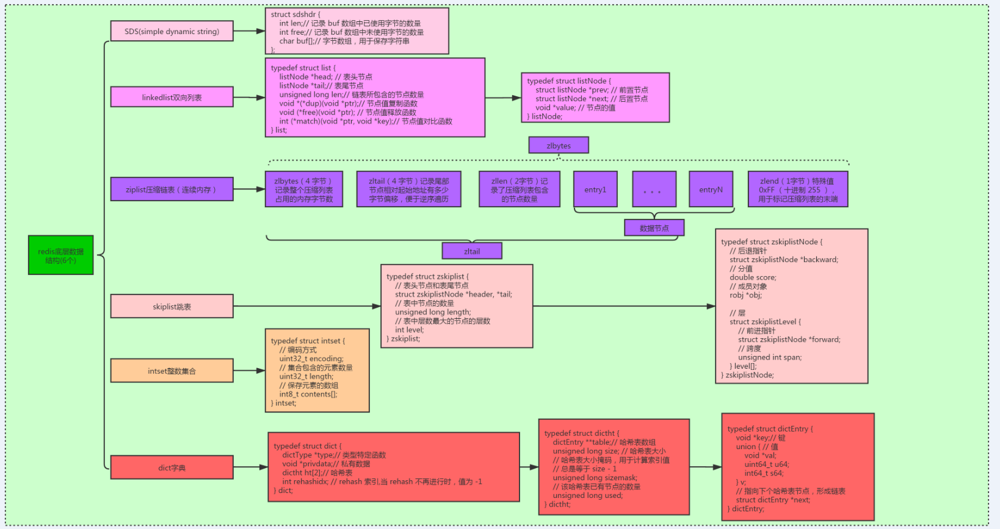

redis图解

<!-- TOC -->

- [1、底层数据模型](#1底层数据模型)
- [2、各种数据类型的应用实例](#2各种数据类型的应用实例)
- [3、各种数据类型的操作方法](#3各种数据类型的操作方法)
- [参考](#参考)
- [编码方式](#编码方式)

<!-- /TOC -->

# 1、底层数据模型

# 2、各种数据类型的应用实例

# 3、各种数据类型的操作方法

# 参考

- [Redis 设计与实现](http://redisbook.com/)
- [为什么要用Redis？Redis为什么这么快？](https://zhuanlan.zhihu.com/p/81195864)
- [选择合适Redis数据结构，减少80%的内存占用](https://zhuanlan.zhihu.com/p/98033960)
- [为什么我们做分布式使用 Redis ？](https://zhuanlan.zhihu.com/p/50392209)
- [既生 Redis 何生 LevelDB ？](https://zhuanlan.zhihu.com/p/53299778)
- [一文揭秘单线程的Redis为什么这么快?](https://zhuanlan.zhihu.com/p/57089960)
- [Redis简明教程](https://zhuanlan.zhihu.com/p/37055648)
- [在线测试redis命令网站](http://try.redis.io/)
- [redis原理](https://zhuanlan.zhihu.com/p/73733011)
- [深入学习Redis（1）：Redis内存模型](https://www.cnblogs.com/kismetv/p/8654978.html)
- [聊聊redis的数据结构的应用](https://segmentfault.com/a/1190000016472058)
- [Redis 概念以及底层数据结构](https://segmentfault.com/a/1190000018887256)
- [Redis专题(2)：Redis数据结构底层探秘](https://segmentfault.com/a/1190000019441134)

画图
1、编码类型（内存中的数据结构，转化条件）；
2、各种数据类型的应用实例；
3、各种数据类型的操作方法；

1、为什么Redis这么快？

首先，采用了多路复用io阻塞机制
然后，数据结构简单，操作节省时间
最后，运行在内存中，自然速度快

2、Redis为什么是单线程的？

因为Redis的瓶颈不是cpu的运行速度，而往往是网络带宽和机器的内存大小。再说了，单线程切换开销小，容易实现既然单线程容易实现，而且CPU不会成为瓶颈，那就顺理成章地采用单线程的方案了。

这里的单线程，只是在处理我们的网络请求的时候只有一个线程来处理，一个正式的Redis Server运行的时候肯定是不止一个线程的，这里需要大家明确的注意一下！

而且需要区分并发和并行的概念，并发并不是并行。即redis的单线程依旧可以处理高并发请求。
（相关概念：并发性I/O流，意味着能够让一个计算单元来处理来自多个客户端的流请求。并行性，意味着服务器能够同时执行几个事情，具有多个计算单元）

Redis是典型的Key-Value类型数据库，Key为字符类型，Value的类型常用的为五种类型：String、Hash 、List 、 Set 、 Zset

# 编码方式

0、String 整数，浮点数或者字符串（int/embstr/raw）[应用：]

String 对象的编码可以是 int 或 raw，对于 String 类型的键值，如果我们存储的是纯数字，Redis 底层采用的是 int 类型的编码，如果其中包括非数字，则会立即转为 raw 编码

1、List 列表（zip list->linked list ）[应用：]
列表对象保存的所有字符串元素的长度都小于 64 字节。
列表对象保存的元素个数小于 512 个。

如果不满足这两个条件的任意一个，就会转化为 linkedlist 编码。注意：这两个条件是可以修改的，在 redis.conf 
list-max-ziplist-entries 512
list-max-ziplist-value 64

2、Zset 有序集合（zip list->skip list 因为有序则可以通过跳表构建层级索引）   [应用：排行榜]

当 Zset 对象同时满足一下两个条件时，采用 ziplist 编码：

Zset 保存的元素个数小于 128。
Zset 元素的成员长度都小于 64 字节。
如果不满足以上条件的任意一个，ziplist 就会转化为 zkiplist 编码。注意：这两个条件是可以修改的，在 redis.conf 中：

zset-max-ziplist-entries 128
zset-max-ziplist-value 64

3、Hash 散列表（zip list->hashtable）[应用：]

当 Hash 对象同时满足以下两个条件时，Hash 对象采用 ziplist 编码：

Hash 对象保存的所有键值对的键和值的字符串长度均小于 64 字节。
Hash 对象保存的键值对数量小于 512 个。
如果不满足以上条件的任意一个，ziplist 就会转化为 hashtable 编码。注意：这两个条件是可以修改的，在 redis.conf 中
hash-max-ziplist-entries 512
hash-max-ziplist-value 64

4、Set 集合（intset->hashtable）[应用：]

当 Set 对象同时满足以下两个条件时，对象采用 intset 编码：

保存的所有元素都是整数值（小数不行）。
Set 对象保存的所有元素个数小于 512 个。
不能满足这两个条件的任意一个，Set 都会采用 hashtable 存储。注意：第两个条件是可以修改的，在 redis.conf 中
set-max-intset-entries 512

zipList最大的特点就是，它根本不是hash结构，而是一个比较长的字符串，将key-value都按顺序依次摆放到一个长长的字符串里来存储。如果要找某个key的话，就直接遍历整个长字符串就好了。
这里是不是变成数组了？

压缩列表 ziplist 是为 Redis 节约内存而开发的，是列表键和字典键的底层实现之一。
当元素个数较少时，Redis 用 ziplist 来存储数据，当元素个数超过某个值时，链表键中会把 ziplist 转化为 linkedlist，字典键中会把 ziplist 转化为 hashtable。
ziplist 是由一系列特殊编码的连续内存块组成的顺序型的数据结构，ziplist 中可以包含多个 entry 节点，每个节点可以存放整数或者字符串。

各个数据类型的用法？存的目的是为了高效的取出来

