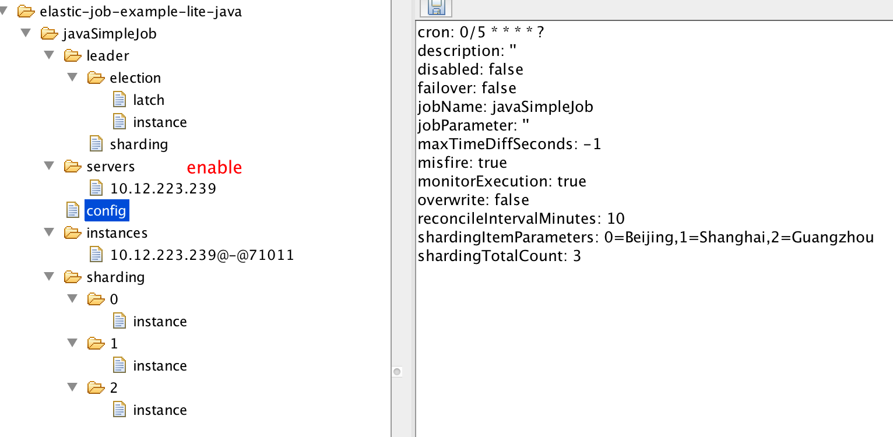
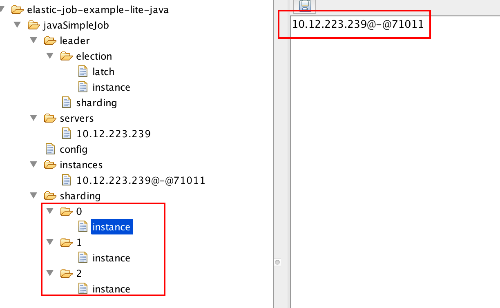

# 1. 、xxl-job


分片调度机制


选择分片广播的时候会通过注册执行器列表获取全部的运行实例，比如3个实例：

循环调用三个实例，传递分片（0，3）、（1，3）、（2，3）


这个分片参数会在用户执行代码中获取到，然后基于分片参数做自己的逻辑处理。


```java
@JobHandler(value="shardingJobHandler")
@Component
public class ShardingJobHandler extends IJobHandler {

	@Override
	public ReturnT<String> execute(String param) throws Exception {

		// 分片参数
		ShardingUtil.ShardingVO shardingVO = ShardingUtil.getShardingVo();
		XxlJobLogger.log("分片参数：当前分片序号 = {}, 总分片数 = {}", shardingVO.getIndex(), shardingVO.getTotal());

		// 业务逻辑
		for (int i = 0; i < shardingVO.getTotal(); i++) {
			if (i == shardingVO.getIndex()) {
				XxlJobLogger.log("第 {} 片, 命中分片开始处理", i);
			} else {
				XxlJobLogger.log("第 {} 片, 忽略", i);
			}
		}

		return SUCCESS;
	}

}
```


# 2、elasticjob







