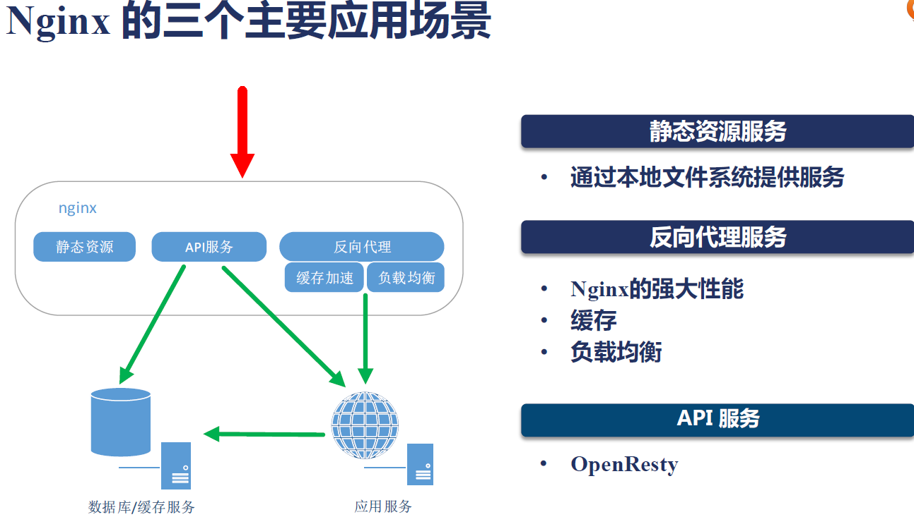
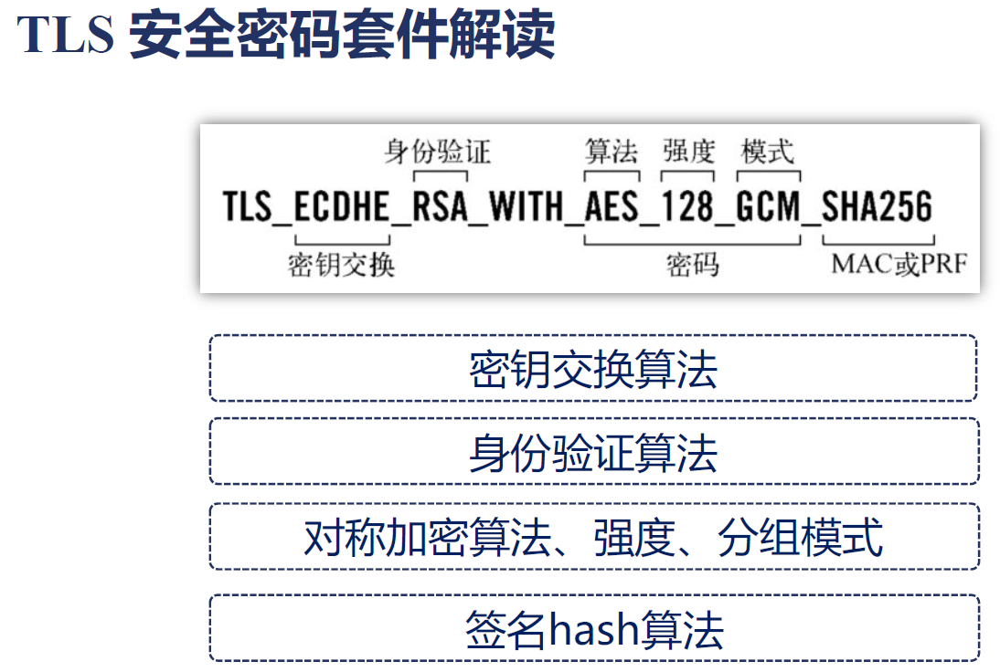
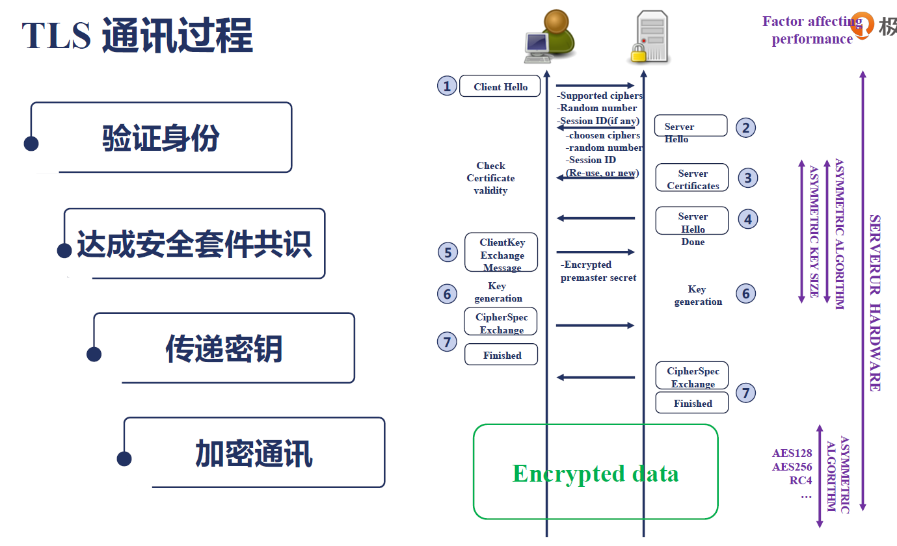
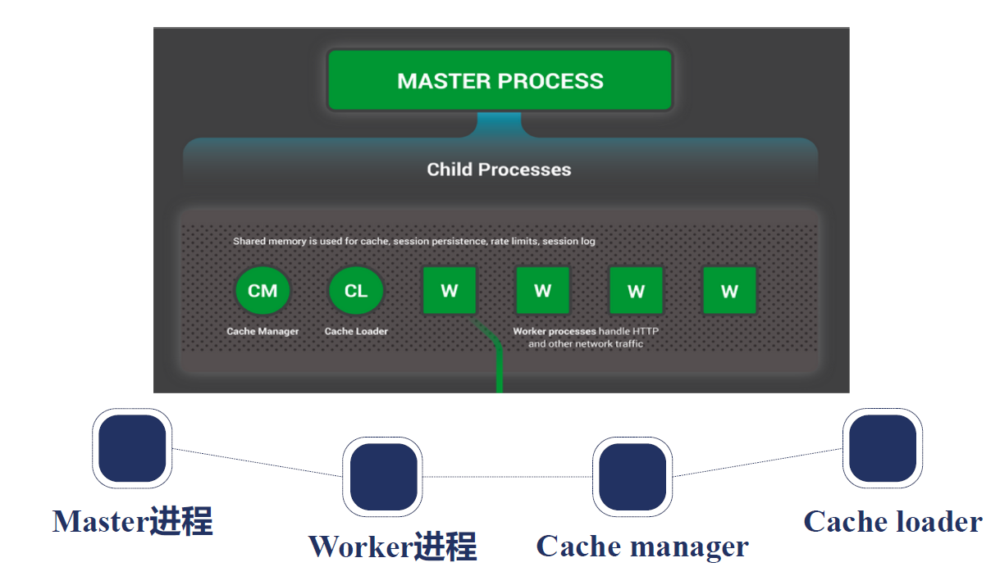
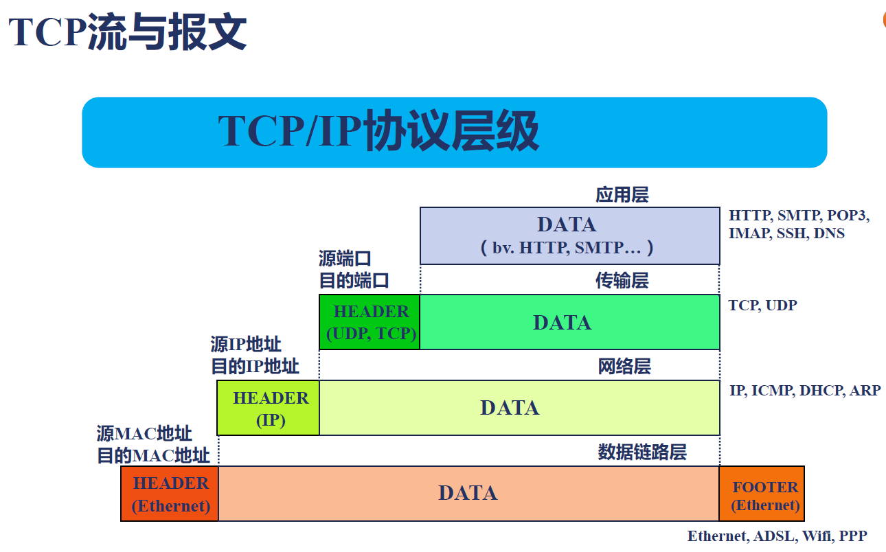
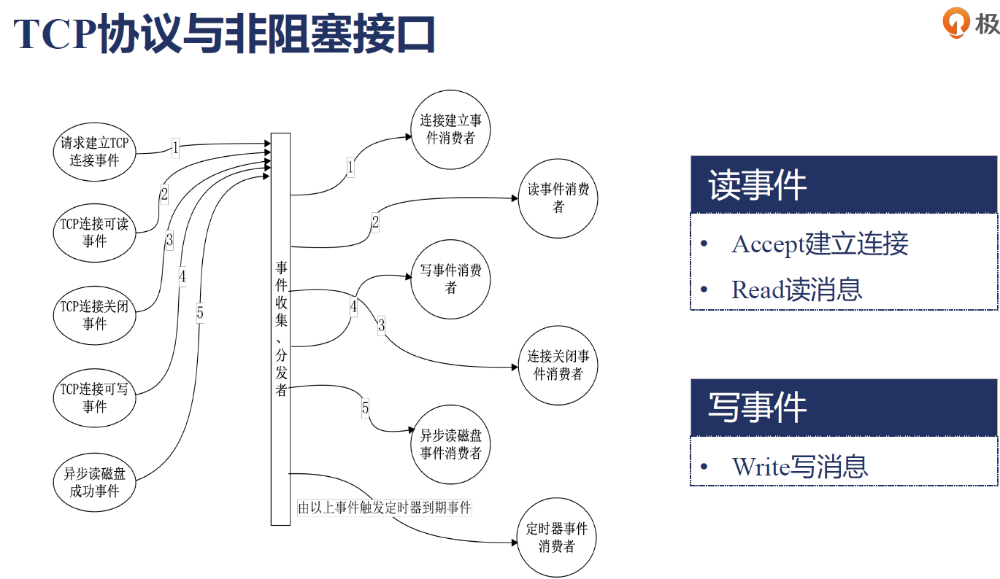
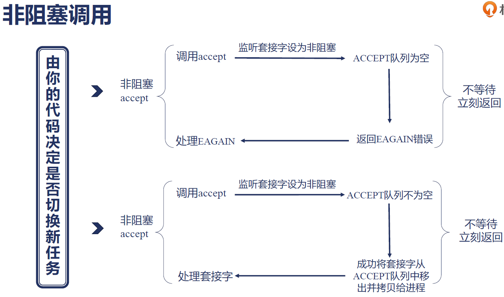
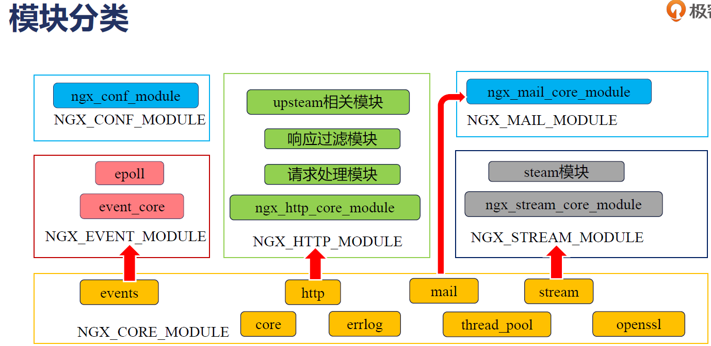
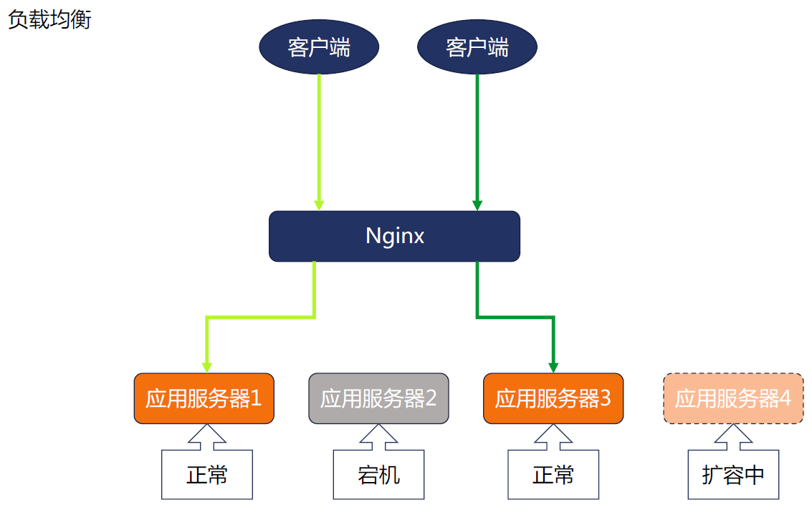
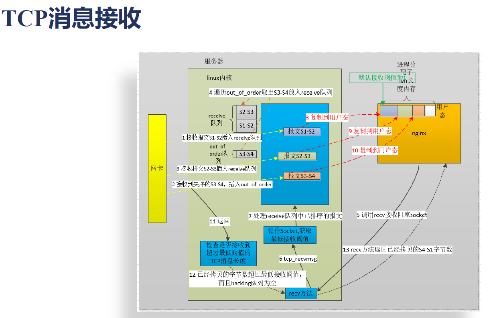

第一章：初识Nginx (19讲)

01 | 课程综述
已学完
02 | Nginx适用于哪些场景？




优点：

- 1、高并发、高性能，高可靠，可扩展性好；
- 2、热部署；
- 3、bsd许可证；

Nginx组成

- 1、二进制可执行文件：由各个源码模块编译出的一个文件；
- 2、access.log访问日志：记录每一条http请求；
- 3、nginx.config配置文件：控制nginx的行为；
- 4、error.log错误日志：定位问题；


tengine淘宝基于nginx进行二次开发而开源的web服务器项目。

http://openresty.org


语法示例：

```
http {
    upstream CashServers {
        server CashServers1.com;
    }

    server {
        listen 80;

        location / {
            proxy_pass http://CashServers;        }
    }
}

```


TLS/SSL发展








已学完
03 | Nginx出现的历史背景
已学完
04 | 为什么用Nginx：它的 5 个主要优点
05 | Nginx的四个主要组成部分
06 | Nginx的版本发布历史
已学完
07 | 选择哪一个Nginx发行版本？
08 | 编译出适合自己的Nginx
09 | Nginx配置文件的通用语法介绍
10 | Nginx命令行及演示：重载、热部署、日志切割
11 | 用Nginx搭建一个可用的静态资源Web服务器
12 | 用Nginx搭建一个具备缓存功能的反向代理服务
13 | 用GoAccess实现可视化并实时监控access日志
14 | 从网络原理来看SSL安全协议
15 | 对称加密与非对称加密各自的应用场景
16 | SSL证书的公信力是如何保证的？
17 | SSL协议握手时Nginx的性能瓶颈在哪里？
18 | 用免费SSL证书实现一个HTTPS站点
19 | 基于OpenResty用Lua语言实现简单服务
第二章：Nginx架构基础 (22讲)

20 | Nginx的请求处理流程


21 | Nginx的进程结构




22 | Nginx的进程结构实例演示
23 | 使用信号管理Nginx的父子进程


24 | reload重载配置文件的真相


25 | 热升级的完整流程


26 | 优雅地关闭worker进程


27 | 网络收发与Nginx事件间的对应关系








28 | Nginx网络事件实例演示
29 | Nginx的事件驱动模型
30 | epoll的优劣及原理


31 | Nginx的请求切换


32 | 同步&异步、阻塞&非阻塞之间的区别





33 | Nginx的模块究竟是什么？
34 | Nginx模块的分类



35 | Nginx如何通过连接池处理网络请求
36 | 内存池对性能的影响
37 | 所有worker进程协同工作的关键：共享内存

> 基础同步工具
- 信号
- 共享内存

> 高级通讯方式
- 锁
- slab内存管理器


38 | 用好共享内存的工具：Slab管理器
39 | 哈希表的max_size与bucket_size如何配置
40 | Nginx中最常用的容器：红黑树


41 | 使用动态模块来提升运维效率
第三章：详解HTTP模块 (40讲)

42 | 第三章内容介绍


43 | 冲突的配置指令以谁为准？
44 | Listen指令的用法
45 | 处理HTTP请求头部的流程
46 | Nginx中的正则表达式
47 | 如何找到处理请求的server指令块
48 | 详解HTTP请求的11个阶段


49 | 11个阶段的顺序处理
50 | postread阶段：获取真实客户端地址的realip模块


51 | rewrite阶段的rewrite模块：return指令
52 | rewrite阶段的rewrite模块：重写URL
53 | rewrite阶段的rewrite模块：条件判断
54 | find_config阶段：找到处理请求的location指令块
55 | preaccess阶段：对连接做限制的limit_conn模块
56 | preaccess阶段：对请求做限制的limit_req模块
57 | access阶段：对ip做限制的access模块
58 | access阶段：对用户名密码做限制的auth_basic模块
59 | access阶段：使用第三方做权限控制的auth_request模块
60 | access阶段的satisfy指令
61 | precontent阶段：按序访问资源的try_files模块
62 | 实时拷贝流量：precontent阶段的mirror模块
63 | content阶段：详解root和alias指令
64 | static模块提供的3个变量
65 | static模块对url不以斜杠结尾却访问目录的做法
66 | index和autoindex模块的用法
67 | 提升多个小文件性能的concat模块
68 | access日志的详细用法
69 | HTTP过滤模块的调用流程


70 | 用过滤模块更改响应中的字符串：sub模块
71 | 用过滤模块在http响应的前后添加内容：addition模块
72 | Nginx变量的运行原理
73 | HTTP框架提供的请求相关的变量
74 | HTTP框架提供的其他变量
75 | 使用变量防盗链的referer模块
76 | 使用变量实现防盗链功能实践：secure_link模块
77 | 为复杂的业务生成新的变量：map模块
78 | 通过变量指定少量用户实现AB测试：split_client模块
79 | 根据IP地址范围的匹配生成新变量：geo模块
80 | 使用变量获得用户的地理位置：geoip模块
81 | 对客户端使用keepalive提升连接效率
第四章：反向代理与负载均衡 (38讲)

82 | 反向代理与负载均衡原理




83 | 负载均衡策略：round-robin
84 | 负载均衡哈希算法：ip_hash与hash模块
85 | 一致性哈希算法：hash模块
86 | 最少连接算法以及如何跨worker进程生效
87 | upstream模块提供的变量
88 | proxy模块处理请求的流程
89 | proxy模块中的proxy_pass指令
90 | 根据指令修改发往上游的请求
91 | 接收用户请求包体的方式
92 | 与上游服务建立连接
93 | 接收上游的响应
94 | 处理上游的响应头部
95 | 上游出现失败时的容错方案
96 | 对上游使用SSL连接
97 | 用好浏览器的缓存
98 | Nginx决策浏览器过期缓存是否有效
99 | 缓存的基本用法
100 | 对客户端请求的缓存处理流程
101 | 接收上游响应的缓存处理流程
102 | 如何减轻缓存失效时上游服务的压力
103 | 及时清除缓存
104 | uwsgi、fastcgi、scgi指令的对照表
105 | memcached反向代理的用法
106 | 搭建websocket反向代理
107 | 用分片提升缓存效率
108 | open file cache提升系统性能
109 | HTTP/2协议介绍


110 | 搭建HTTP/2服务并推送资源
111 | gRPC反向代理
112 | stream四层反向代理的7个阶段及常用变量
113 | proxy protocol协议与realip模块
114 | 限并发连接、限IP、记日志
115 | stream四层反向代理处理SSL下游流量
116 | stream_preread模块取出SSL关键信息
117 | stream proxy四层反向代理的用法
118 | UDP反向代理
119 | 透传IP地址的3个方案
第五章：Nginx的系统层性能优化 (18讲)

120 | 性能优化方法论


121 | 如何高效使用CPU
122 | 多核间的负载均衡
123 | 控制TCP三次握手参数


124 | 建立TCP连接的优化
125 | 滑动窗口与缓冲区





126 | 优化缓冲区与传输效率
127 | 慢启动与拥塞窗口
128 | TCP协议的keepalive功能
129 | 减少关闭连接时的time_wait端口数量
130 | lingering_close延迟关闭TCP连接
131 | 应用层协议的优化
132 | 磁盘IO的优化
133 | 减少磁盘读写次数
134 | 零拷贝与gzip_static模块
135 | 用tcmalloc优化内存分配
136 | 使用Google PerfTools分析Nginx
137 | 使用stub_status模块监控Nginx的状态
第六章：从源码视角深入使用Nginx与OpenResty (18讲)

138 | 第三方模块源码的阅读
139 | Nginx的启动流程
140 | HTTP第三方模块的初始化
141 | if指令是邪恶的吗？
142 | 解读Nginx的核心转储文件
143 | 通过debug日志定位问题
144 | OpenResty概述
145 | OpenResty中的Nginx模块与Lua模块
146 | 如何在Nginx中嵌入Lua代码
147 | OpenResty中Lua与C代码交互的原理
148 | 获取、修改请求与响应的SDK
149 | 工具类型的SDK
150 | 同步且非阻塞的底层SDK：cosocket
151 | 基于协程的并发编程SDK
152 | 定时器及时间相关的SDK
153 | share.DICT基于共享内存的字典
154 | 子请求的使用方法
155 | 基于OpenResty的WAF防火墙


